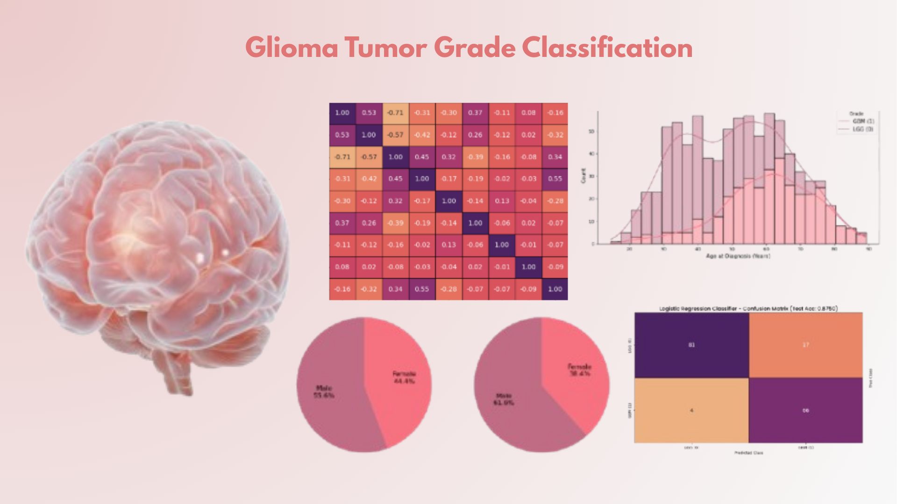

# Capstone Project: Optimal Feature Selection for Cost Efficient Glioma Grade Classification Using Machine Learning

## 1. Project Overview

This project focuses on developing a robust and parsimonious (minimal) classification model to accurately distinguish between **Lower Grade Glioma (LGG)** and **Glioblastoma (GBM)**. The classification utilizes a blend of clinical features (Age, Gender, Race) and a panel of 20 common molecular mutation markers.

## 2. Data Source and Data Preparation
### **2.1 Data Source**
### Data Source
The data for this project was obtained from the UCI Machine Learning Repository.
- **Dataset Name**: Glioma Grading Clinical and Mutation Features  
- **Citation**: Tasci, E., Zhuge, Y., Kaur, H., Camphausen, K., & Krauze, A. V. (2022). Hierarchical Voting-Based Feature Selection and Ensemble Learning Model Scheme for Glioma Grading with Clinical and Molecular Characteristics. International Journal of Molecular Sciences, 23(22), 14155.
- **Source URL**: [https://archive.ics.uci.edu/dataset/759/glioma+grading+clinical+and+mutation+features+dataset](https://archive.ics.uci.edu/dataset/759/glioma+grading+clinical+and+mutation+features+dataset)  
- **Dataset Type**: CSV / Tabular Data  
- **License**: Public / Open Access

This datasets contain curated clinical and genomic information commonly used in cancer research. For this study, the following features were extracted:

- 20 frequently mutated genes
- 3 clinical variables: Age at Diagnosis, Gender, and Race  
- **Target variable:** Tumor Grade (LGG or GBM)

### **2.2 Data Preparation**

The dataset provided was already pre-processed by TCGA and contained **no missing values**, ensuring high data integrity for immediate model development. Since the dataset was already cleaned and contained no null values, only minimal preparation steps were necessary:

-  **Data Integration**  

   The LGG and GBM datasets were combined into a single structured dataframe containing all clinical and mutation features.
-  **Target Variable Processing**

    - The Grade column was renamed to Tumor_Grade for clarity.
    - Numeric values were mapped to descriptive labels: 0 → LGG (Lower Grade), 1 → GBM (Glioblastoma)
-  **Feature Grouping and Standardization**
   
   - Clinical features were separated from mutation features.
   - Continuous features, such as Age_at_diagnosis, were standardized to improve model performance.
- **Feature Type Verification**  
  
   - Mutation features were ensured to be in binary format (0 = no mutation, 1 = mutation).  
   - Clinical features (e.g., Age_at_diagnosis) were validated as numeric.
 - **Train–Test Split**  
   
   The dataset was split into:
   - **Training set:** 70%  
   - **Test set:** 30%
## 3. Problem Statement
- The primary goal is to identify the **optimal, minimal feature subset** required to achieve high predictive performance.
- Accurately predict whether a patient has LGG or GBM based on the optimal clinical and molecular features.
- Reduce diagnostic costs by eliminating unnecessary molecular tests without compromising model accuracy.
## 4. Data Analysis and Key Clinical & Molecular Findings
Initial Exploratory Data Analysis (EDA) revealed critical relationships for classifying tumor grade:
### 4.1. Key Clinical Features Analysis and Findings 

  | **Feature**         | **Observation**                                                                                         | **Significance**                                                                                     |
|---------------------|---------------------------------------------------------------------------------------------------------|-------------------------------------------------------------------------------------------------------|
| **Age at Diagnosis** | Highly predictive; LGG peaks at 35–45 years, while GBM peaks at 60–70 years. Age 60 is a critical decision threshold. | Confirms age as the most powerful clinical differentiator.                                             |
| **Gender**          | Consistent male predominance in both grades, but significantly stronger in GBM than LGG.                | Suggests gender bias increases with tumor malignancy.                                                 |
| **Race**            | Severe sampling bias (91% White). The African American subgroup showed a reversed grade ratio (more GBM than LGG). | Inclusion of race was determined to be suboptimal due to ethical concerns and lack of generalizability. |
### 4.2. Key Molecular Features Analysis and Findings 
| **Analysis**                   | **Observation**                                                                                          | **Significance**                                                                                       |
|------------------------------|------------------------------------------------------------------------------------------------------------|---------------------------------------------------------------------------------------------------------|
| **Overall Mutation Frequency** | The most prevalent mutations across the entire cohort are **IDH1**, followed by **TP53** and **ATRX**.     | These genes are fundamental drivers in the development of gliomas.                                      |
| **Feature Discriminative Power** | ANOVA F-score ranking was performed to separate LGG and GBM.                                               | The predictive power should be centered on four core molecular markers: **IDH1, ATRX, PTEN, and EGFR**. |
| **Mutation Profile by Grade** | The extreme contrast in **IDH1** and **PTEN** mutation profiles forms the biological foundation of the model. | Shows strong, opposing signals that drive the final grade prediction.                                   |
| **Co-Mutation Correlation**  | The strongest positive correlation is between **IDH1** and **ATRX**.                                        | Confirmed no evidence of extreme multicollinearity.                                                     |
## 5. Feature Selection Methodology

A rigorous, two-stage feature selection pipeline was implemented to refine the initial set of **23 candidate features**.

### **Stage 1: Random Forest Ranking**
- **Method:** A Random Forest Classifier assigned an importance score to all features.  
- **Result:** The ranking was dominated by **Age_at_diagnosis** and **IDH1 mutation status**.  
- **Output:** The search space was reduced to the **Top 15 ranked features**.

### **Stage 2: Optimal Subset Selection (Cross-Validation)**
- **Method:** Sequential testing using a Logistic Regression model with **5-Fold Cross-Validation (CV)**, maximizing the **Macro F1-Score**.  
- **Result:** The highest F1-Score was achieved with the optimal set of selected features.  
- **Output:** Features beyond this point were deemed **redundant** and removed from the final model.
## 6. The Optimal Feature Subset and Model Foundation
The final model is based on the following 8 features:
| **Feature**         | **Correlation with GBM**        | **Role**                                                         |
|---------------------|----------------------------------|------------------------------------------------------------------|
| **IDH1**            | (Strong Negative)                | Primary marker for LGG / Secondary GBM.                          |
| **Age_at_diagnosis**| (Strong Positive)                | Primary marker for GBM.                                          |
| **ATRX**            | —                                | Associated with IDH-mutant Astrocytomas (LGG).                  |
| **PTEN**            | —                                | Tumor suppressor gene often lost in GBM.                         |
| **CIC**             | —                                | Associated with Oligodendrogliomas (LGG).                        |
| **TP53**            | —                                | Tumor suppressor often mutated alongside IDH1/ATRX.              |
| **IDH2**            | —                                | Secondary IDH mutation.                                          |
| **Race**            | —                                | Weak linear predictor; kept for model stability/completeness.    |
## 7. Model Evaluation and Final Selection
Three different classifiers were trained and evaluated on the optimal 8-feature subset.
### 7.1 Overall Performance

| **Model**                     | **Test Accuracy** | **Precision (Macro)** | **Recall (Macro)** | **F1-Score (Macro)** |
|------------------------------|-------------------|------------------------|---------------------|-----------------------|
| **Logistic Regression**      | 0.8750            | 0.87                   | 0.88                | 0.88                  |
| **Support Vector Machine (SVC)** | 0.8571        | 0.86                   | 0.87                | 0.86                  |
| **Random Forest Classifier** | 0.8036            | 0.80                   | 0.81                | 0.80                  |
### 7.2 Detailed Performance Metrics (Logistic Regression)

| **Class** | **Precision** | **Recall** | **F1-Score** | **Support** |
|-----------|---------------|------------|--------------|-------------|
| **LGG (0)** | 0.95        | 0.83       | 0.89         | 98          |
| **GBM (1)** | 0.80        | 0.94       | 0.86         | 70          |

### 7.3. Final Selection Rationale

The **Logistic Regression** model was selected as the final classifier because:

- **Highest Performance:**  
  It achieved the highest overall **Macro F1-Score (0.88)** and **Accuracy (0.8750)**.

- **Balanced Prediction:**  
  It demonstrated the best balance between classes, achieving excellent **Recall for GBM (0.94)** while maintaining strong **Precision for LGG (0.95)**.

- **Interpretability (Primary Factor):**  
  Logistic Regression provides direct, linear coefficients, which is essential in clinical applications.This ensures clinicians can easily understand and interpret the model's outputs.
